Vital Vial is a game where you must fight for your life. Fight through endless waves of zombies as you unlock supernatural abilities and increase your arsenal. Go for the highscore by completing as many waves and killing as many zombies as you can.

# Tech Tree

As you kill enemies you will earn experience points.\
As you earn experience points, you will level up.\
When you level up, you gain skill points.\
You can spend these skill points in the tech tree to unlock new abilities and weapons.

The tech tree is laid out such that you must get the previous ability/upgrade before you can get the next. (The previous is whichever is furthest down the line towards the player icon at the top center of the tech tree).

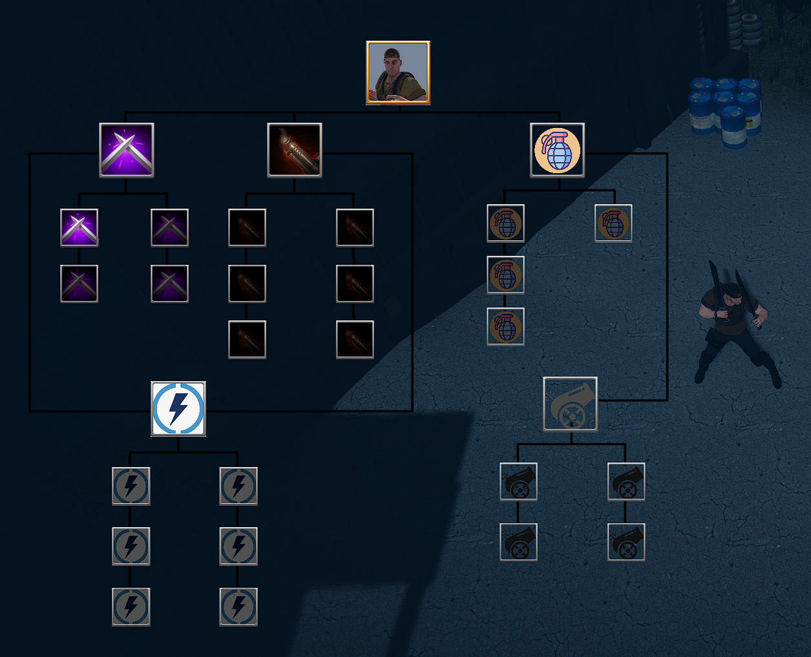

# Supernatural Abilities

## Elemental Attack  
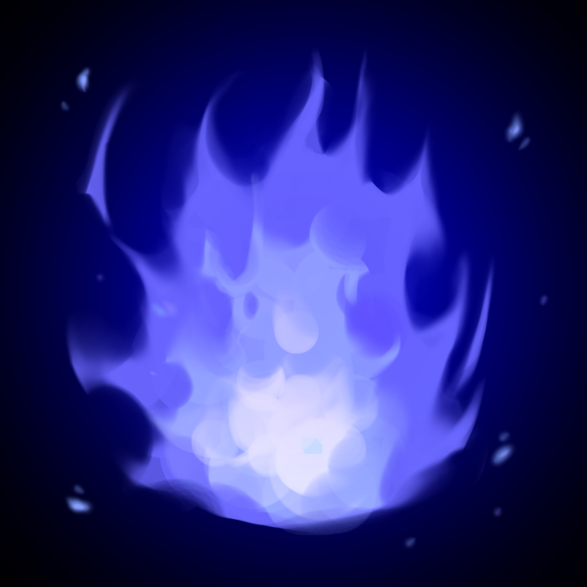

Release flames that do damage over time\
Upgrades:
- Decrease Cooldown
- Increase Duration of Fire Attack
- Increase Fire Damage by 50%
- Enemies Burn 75% Longer
- Fire Can Spread to Nearby Enemies

## Health Boost
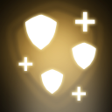

Convert Collected XP into Health\
Upgrades:
- Decrease Cooldown
- Increased Health Gained from XP
- Move 2X as Fast for Duration of Health Boost

## Shock Wave
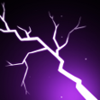

Send Out a Shock that Knocks Enemies Back\
Upgrades:
- Decrease Cooldown
- Increase Range by 50%
- Shock Wave Also Damages Enemies

## Blink
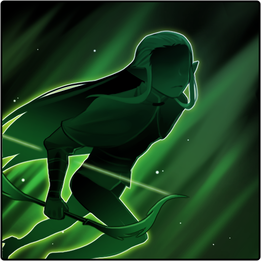

Teleport a Short Distance\
Upgrades:
- Decrease Cooldown
- Blink Twice Before Cooldown
- Increase Blink Distance
- Release a Small Shock Wave After Blinking

## Time Freeze

Freezes Time for All Enemies\
Upgrades:
- Decrease Cooldown
- Double Duration Enemies are Frozen
- Speed Increased by 50% While Ability is Active

## Mind Control
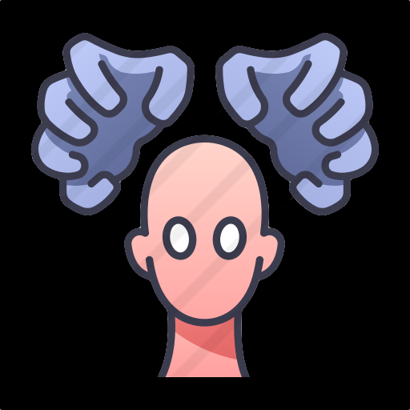

Select Enemies to Start Attacking Other Enemies\
Upgrades:
- Decrease Cooldown
- Controlled Enemies Have 2X Health
- Controlled Enemies Do 2X Damage
- Control Enemies 2X as Long

# Human Abilities

## Melee
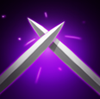

Unlocks Knife\
Upgrades:
- Unlock Machete
- Unlock Katana
- Melee 2X as Fast
- Melee does 2X Damage
- 
## Guns
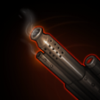

Unlocks Submachine Gun\
Upgrades:
- Unlock Assault Rifle
- Unlock Shotgun
- Unlock LMG
- Guns do 50% More Damage
- Increase Magazine Size by 50%
- Guns do Another 50% More Damage
- 
## Throwables
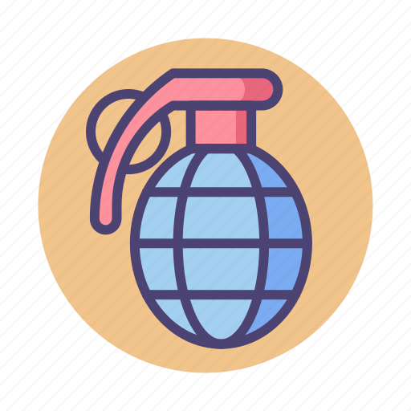

Unlocks Rocks\
Upgrades:
- Unlock Alarm Clock
- Unlock Grenades
- Unlock Proximity Mine
- Carry 50% More Throwables
- 
## Buffs

Attacks do 50% More Damage\
Upgrades:
- Dash Twice as Quick
- Reload 2X as Fast
- Invulnerability after Dash
- Gain Speed Boost after Dash
- Auto Health Regen When Low Health
- Release Damaging Shock Wave after Dash

## Turrets

Can Place Turrets that will shoot at Zombies and Self Destruct when out of Ammo\
Upgrades:
- Carry 2X the Turrets
- Turrets Have 2X Ammo
- Turrets do 2X Damage
- Turrets Overheat Less Often

# Wave Spawning

Zombies Spawn in Waves.\
The First Wave is **5** Zombies.\
Each Wave Adds **2** Zombies.\
Max Zombie Amount is **100**.\
A Zombie Spawns Every **1** Second.\
Time Between Waves is **5** Seconds.\
The Next Wave Begins When All Zombies Die.

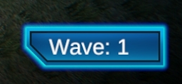

# Leaderboard

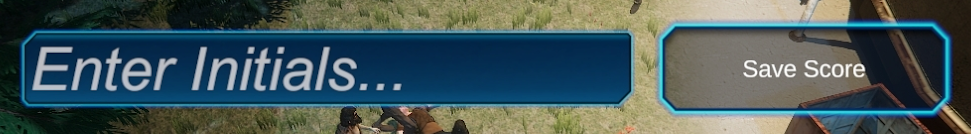

When you die, you will be prompted to enter up to 3 characters for your initials.\
Pressing save will save your score locally (if score would be in the top ten).\
The top 10 scores are saved and displayed on the main menu.

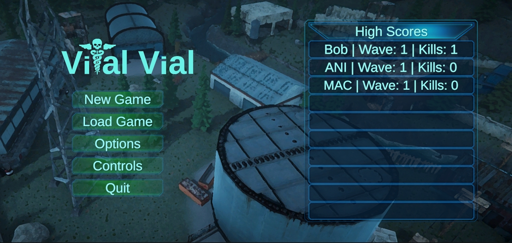

# Enemies

## Greybeard Grunt

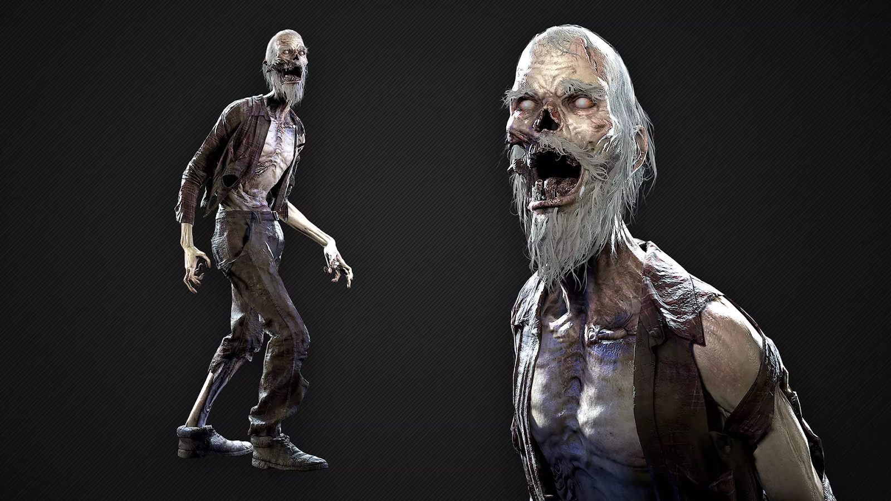

Health: 100\
Speed: 3\
Damage: 10\
XP: 100

## Crone

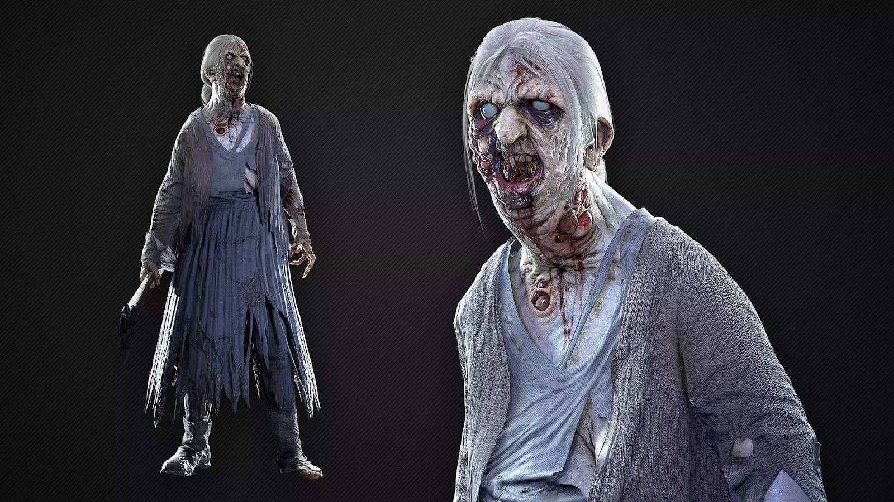

Health: 50\
Speed: 4\
Damage: 20\
XP: 200

## Butcher Brute

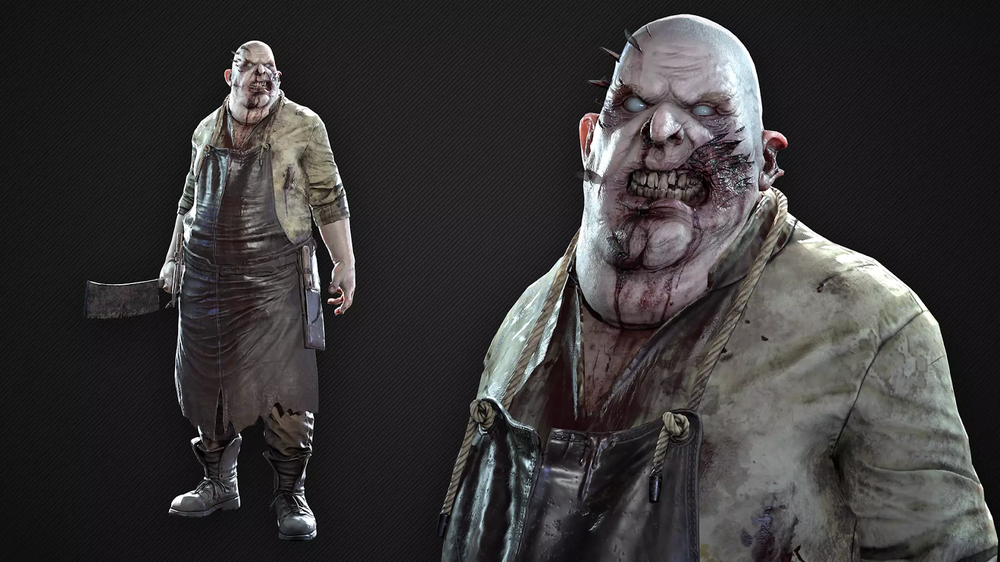

Health: 250\
Speed: 4\
Damage: 25\
XP: 500

# Pickups

## Health Pickup

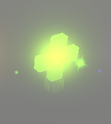

Heals to Max Health

## Ammo Pickup

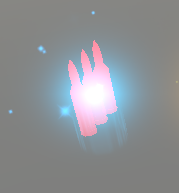

Fills Weapon’s Ammo to Max

## Ability Refresh Pickup

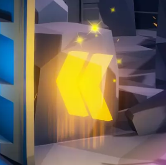

Ends Ability Cooldowns

## Random Attribute Pickup

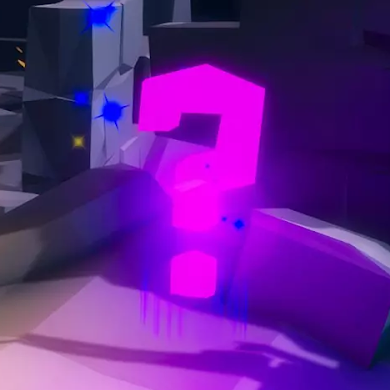

Increases Random Attribute\
Possible Attributes:
- Increased Movement Speed
- Increased Gun Damage
- Increased Gun Magazine Size
- Increased Melee Speed
- Increased Melee Damage
- Increased Reload Speed
- Increased Dash Speed Boost
- Health Regen Begins at Higher Health
- Health Regen Heals to Higher Amount
- Increased Health Regen Speed

# Map

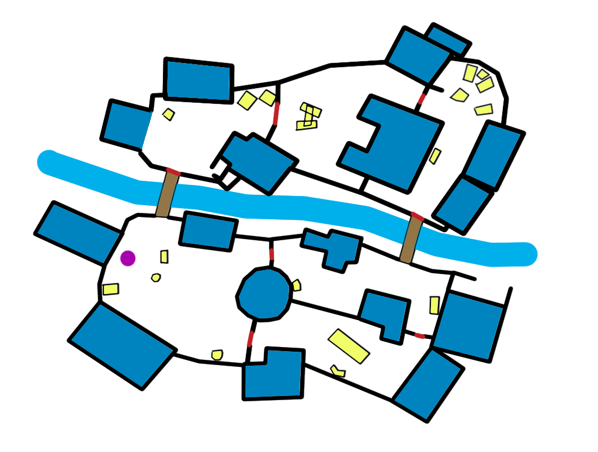

There is currently a single map known as Workshop.\
Above is a layout of the map.
- Yellow: Small Obstacles
- Dark Blue: Buildings
- Brown: Bridges
- Light Blue: A River
- Purple: Player Starting Position
- Red: Buyable Doors

Going near a buyable door will prompt the player to spend a skill point to remove the door.\
This forces the player to choose between new abilities or new areas.

# Controls

## Default Keyboard/Mouse Layout:

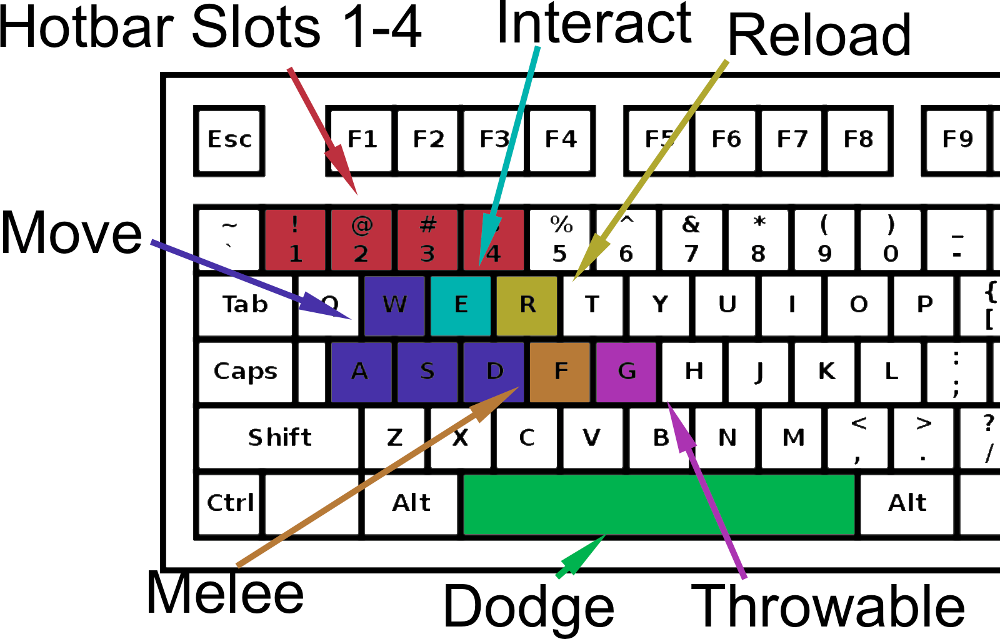
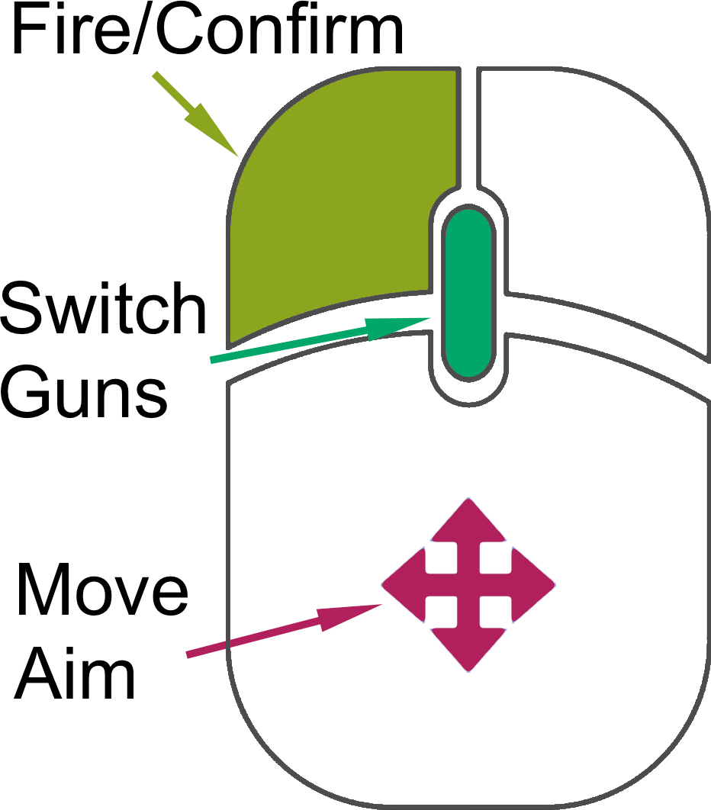

## Default Gamepad Layout:

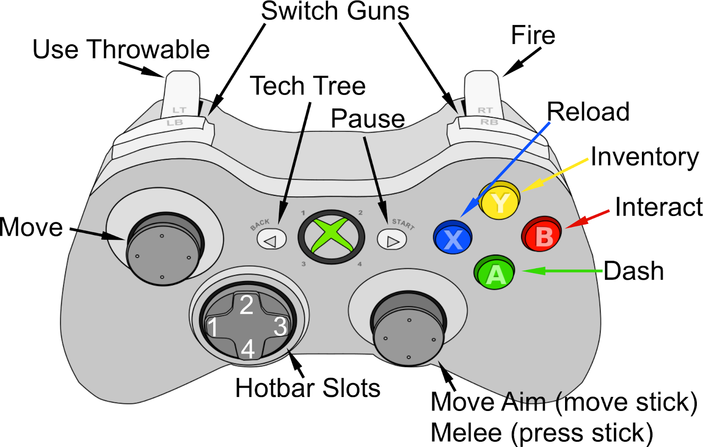

These bindings can be changed at any time from the options menu which is available from the pause menu and main menu.

# Save-Load System

The game will autosave after a round has ended. This autosave can be loaded from the main menu.

At any time, you can save your game from the pause menu. You have 3 slots to choose to save to.\
Note that when you save it saves to the start of the wave (when you were last safe). 

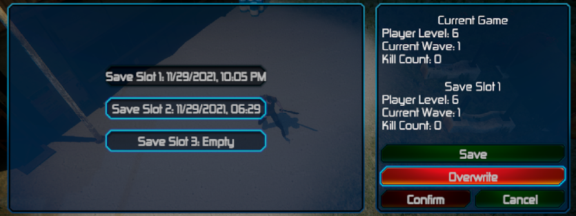

You can load back any of these save slots (or autosave) from the main menu.

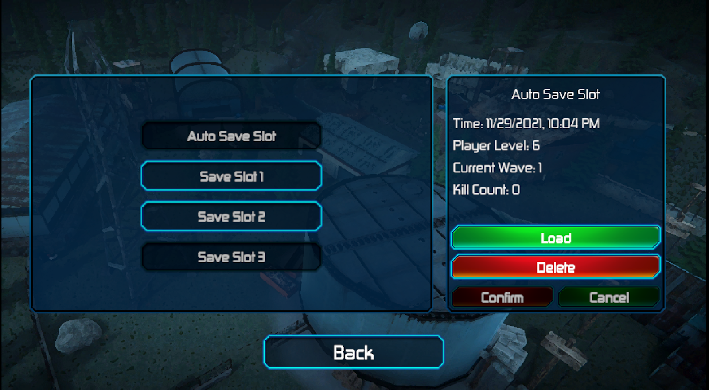

