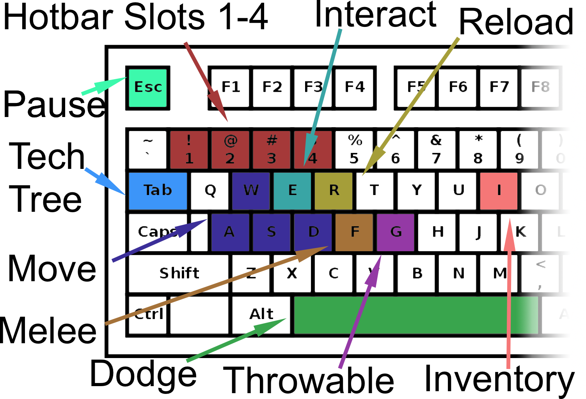
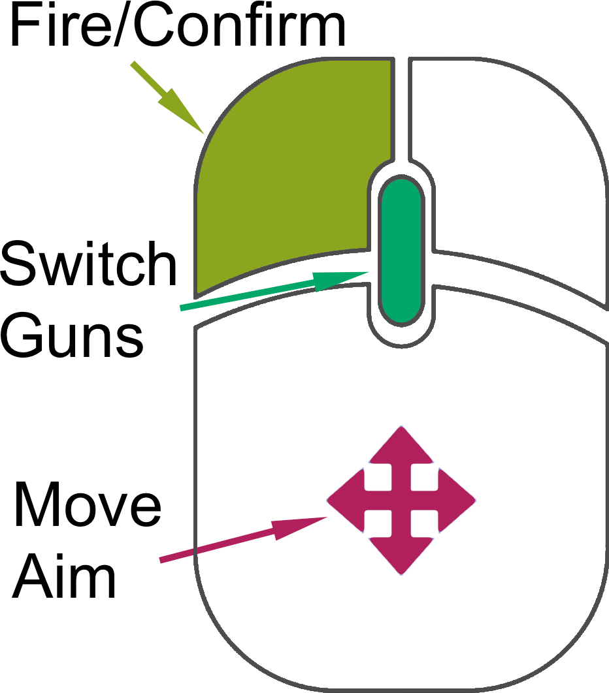
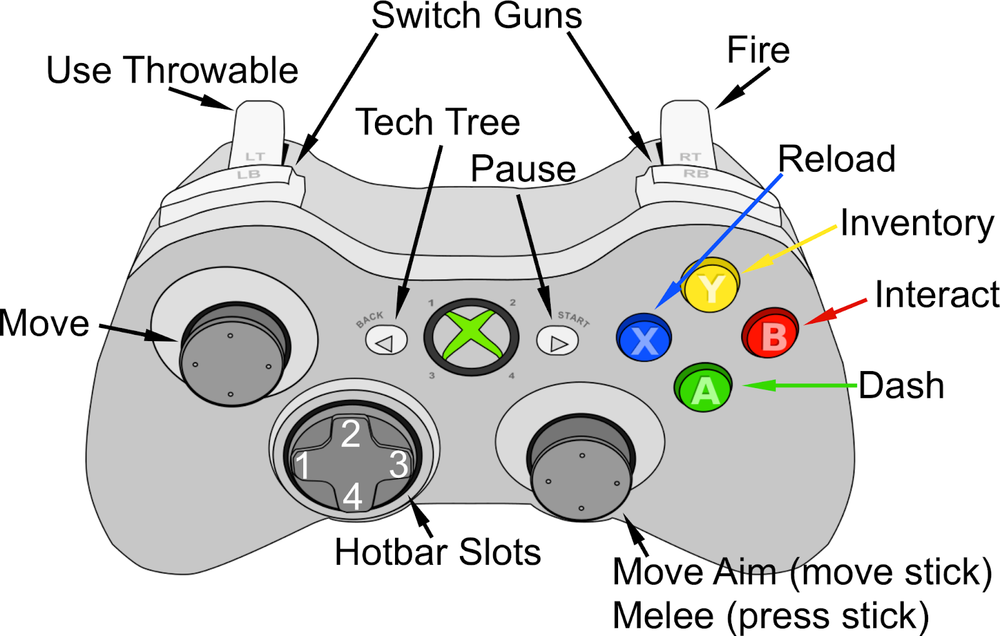

# Getting Started

The docs files contains resources that teach you how to get started. It also contains information on more in depth topics, like each tech tree ability or some of the more technical aspects of the game.

The main point of the game is to survive. This gets harder as each new wave brings more and more zombies. However, as you kill zombies, you will gain experience and level up. Leveling up gives you skill points, which allows you to unlock new skills on the Tech Tree or access new areas of the map. 

The controls for the game are below.

 

This is all you'll need to get started with the game. To see more advanced guides, see the content section below.

---
## Folder Contents
- [Complete Guide](Complete%20Guide.md)
- [Gameplay Poster](Gameplay%20Poster.pdf)
- [Technical Poster](Technical%20Poster.pdf)